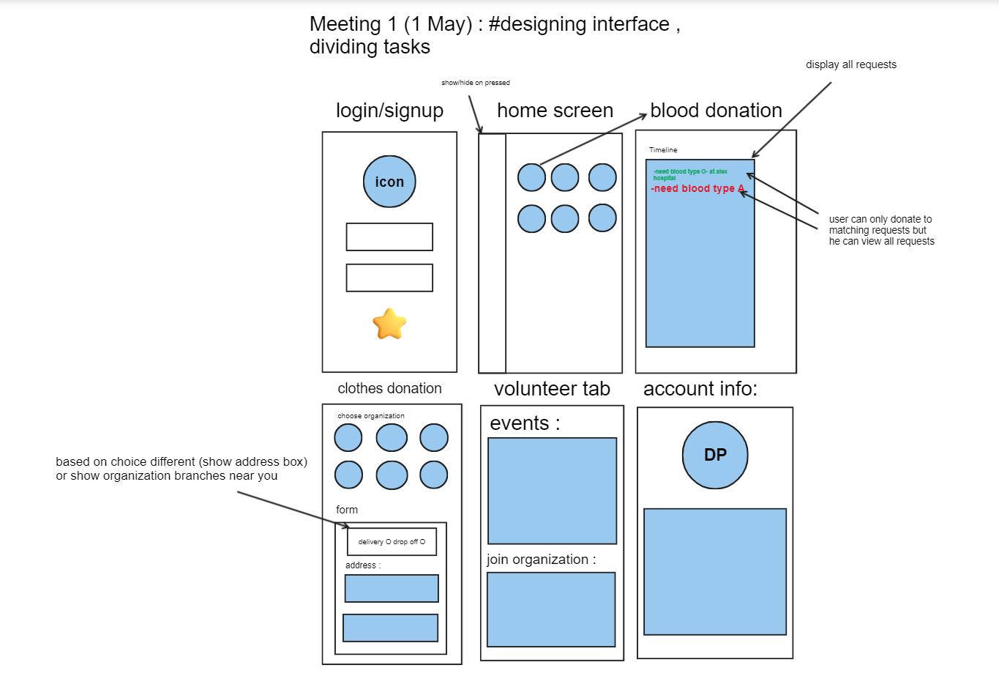

6721 hossamemamo
6738 Ihabsherif
6827 seifbassiounyy

# Meeting #1 : 

Overview

The proposed app aims to connect individuals who wish to donate with organizations that are in need of these resources. The purpose of this proposal is to suggest the development of a mobile application that will enable users to donate food, blood, money, and participate in charitable activities. 

Requirements

1-Functional Requirements:

- A cross-platform mobile application that will serve as a connection between individuals and organizations to connect and engage in Blood donation. 

-The application will be available for download on both iOS and Android platforms.

- The user will be able to contribute by donating blood

- The system should provide the user with the new updates of needed blood donations according to the user's registered blood type, and the location. The user can then register to donate blood and specify the suitable date.

- The system shows the user’s account information in personal account information.

2-Non-Functional Requirements:

- The system is a cross-platform mobile application which could be accessed and used through Android and IOS devices, as well as, web browser.

- A user-friendly interface that is easy to navigate.

- The system should authenticate users according to their registered data in the database.
- The mobile application should only operate within Alexandria governorate as a beginning.
